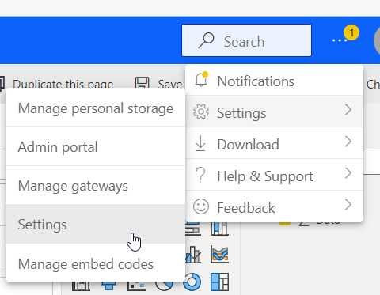
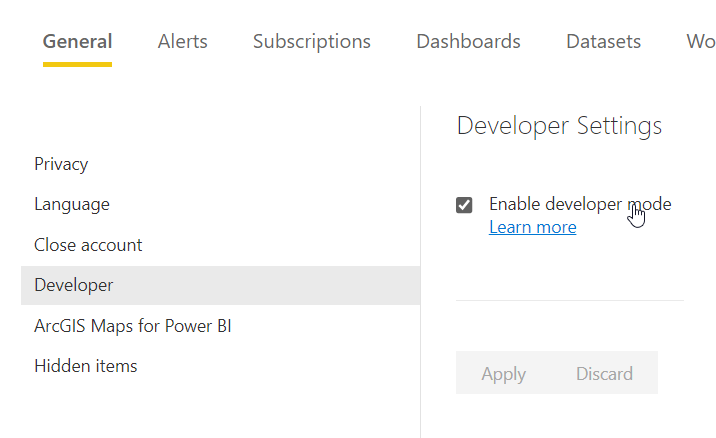
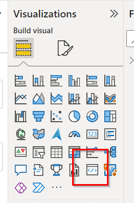
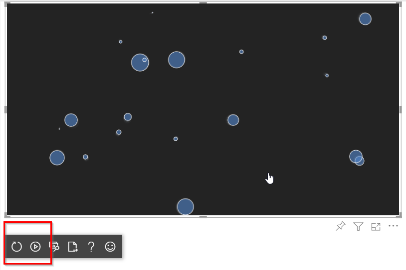
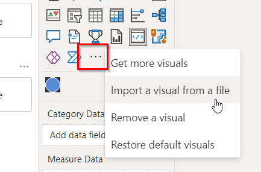

# How To
Below is the general flow of development, testing, packing, and using a custom visual for Power BI.  Adding *React* to the equation is an implementation detail and does not affect any meaningful part of this process.

1) Log on to the [PBI homepage](https://app.powerbi.com/)

> You may be able to use the Desktop App, but I have not tested this.

2) Enable **Developer Mode**

3) Add the **Developer Visual** to the report

4) In the *Visual Studio Code*, open the **terminal** and type: `npm start`

> This will start the local server to which the developer visual will connect automatically.  As this uses a *self-signed certificate*, you may need to deal with that "insecure context" nonsense beforehand.  I **always** use MS Edge for this (cursorily, browsers like Brave fail).

5) Manually refresh changes, or enable auto-refresh

6) Once you're ready to package the visual, run the command: `npm package`

> In the `dist/` folder, you will see a newly-generated `.pbiviz` file.  This can be loaded into the report directly (and published, if desired).

7) Enjoy your visual! 😎

# Gotchas
* A visual **must** have data associated with it to trigger an `update` event (this includes changing settings).
* In limited testing, `React.useState` does not work -- but `React.useReducer` does.